# BuyTree

A full-stack e-commerce platform built with modern web technologies.

## Features

- User shopping experience with product browsing and checkout
- Seller dashboard for managing products and orders
- Comprehensive analytics and revenue tracking
- Order management system
- Secure payment processing

## Screenshots

### Homepage
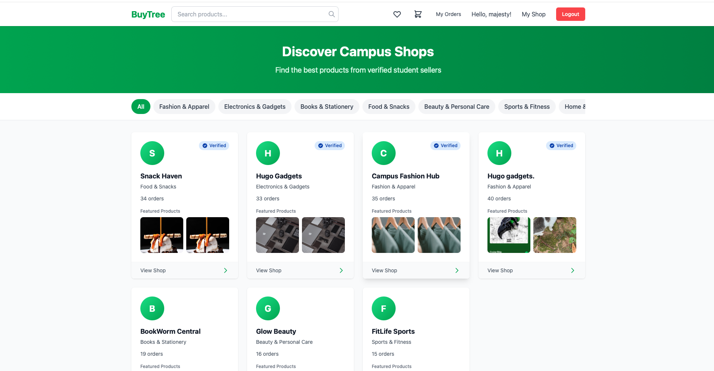

### User Experience

#### Product Details
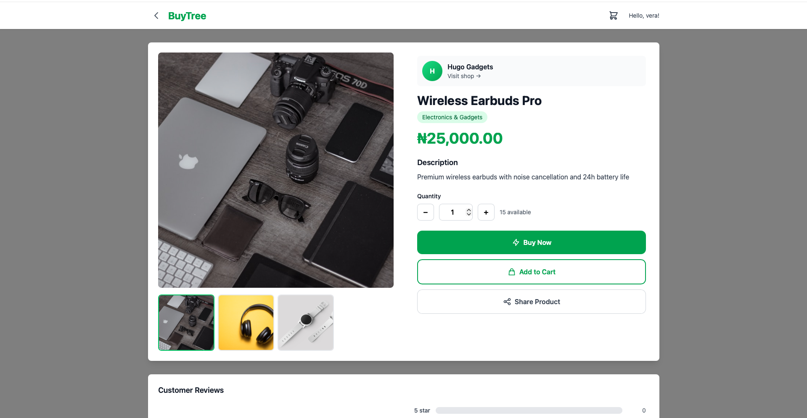

#### Checkout Process
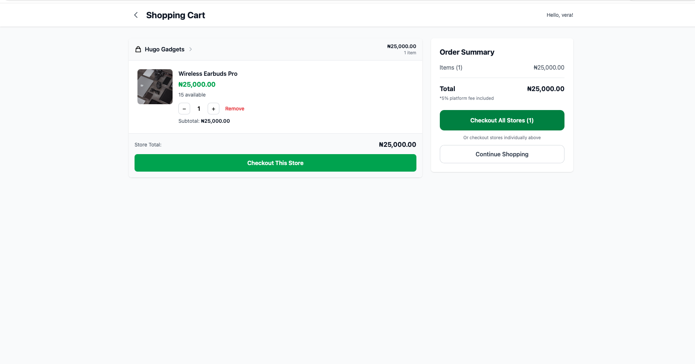
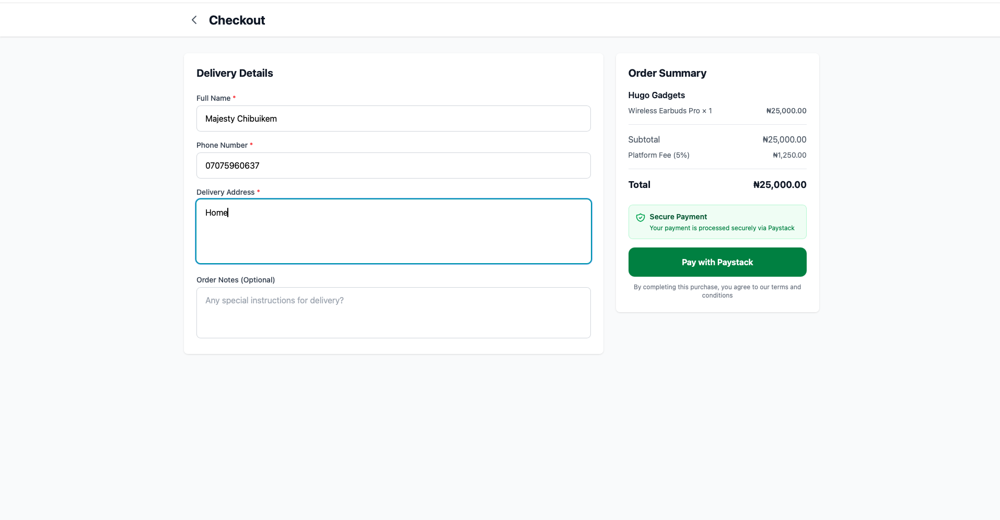
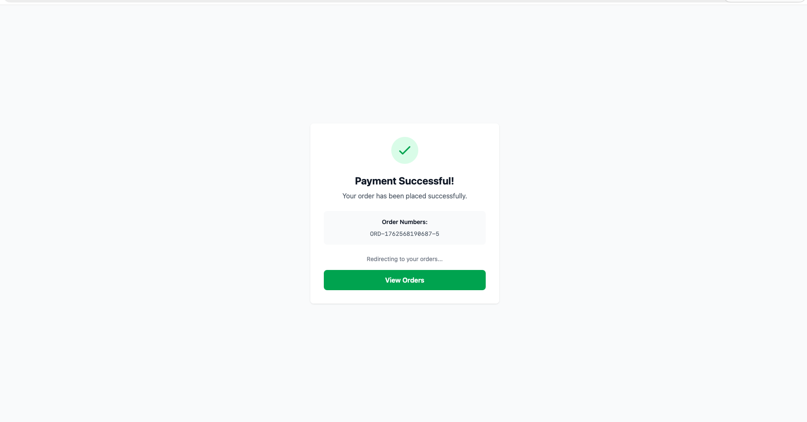

#### Order Tracking
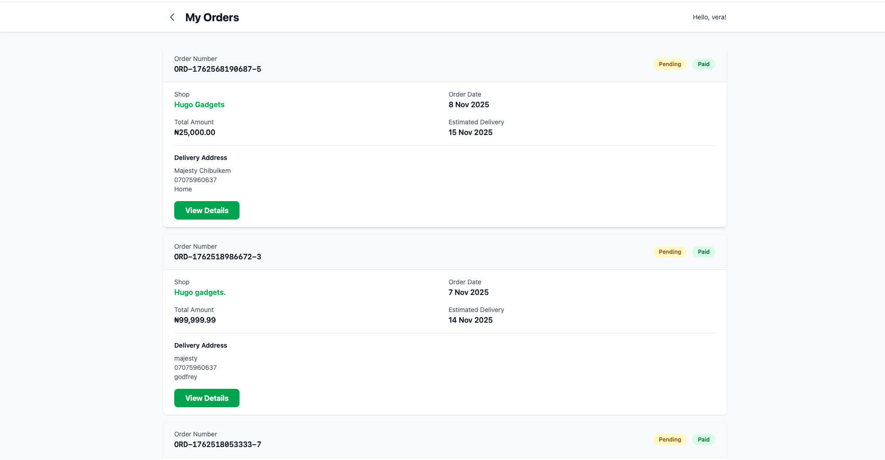

### Seller Dashboard

#### Dashboard Overview
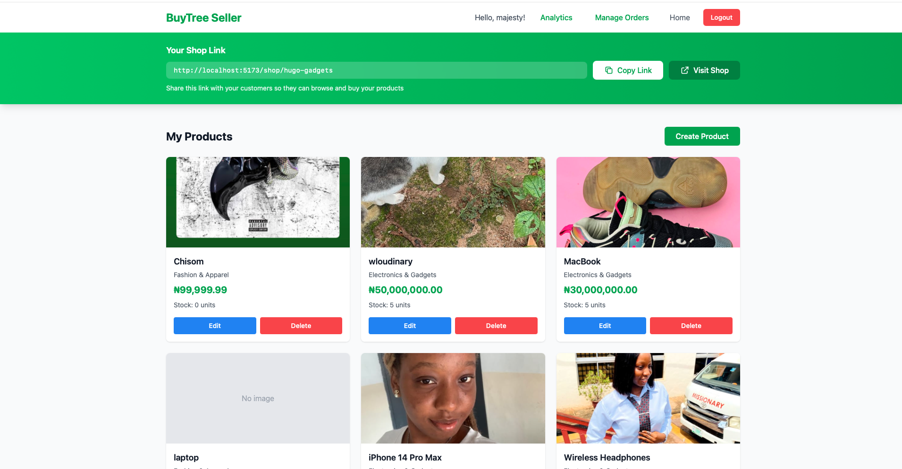

#### Order Management
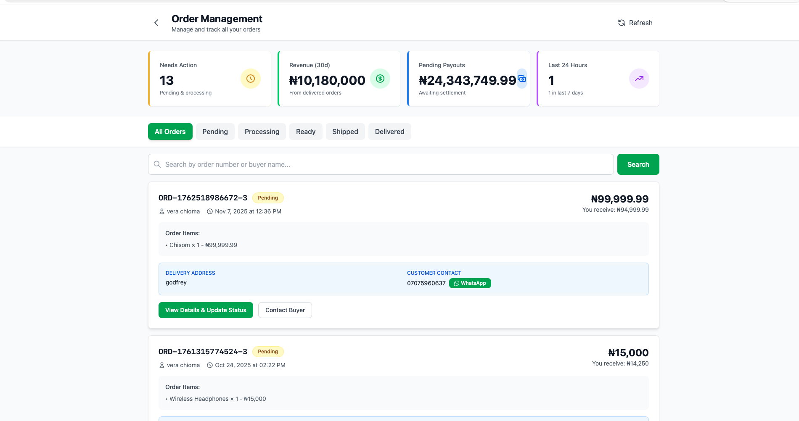

### Analytics

#### Analytics Overview
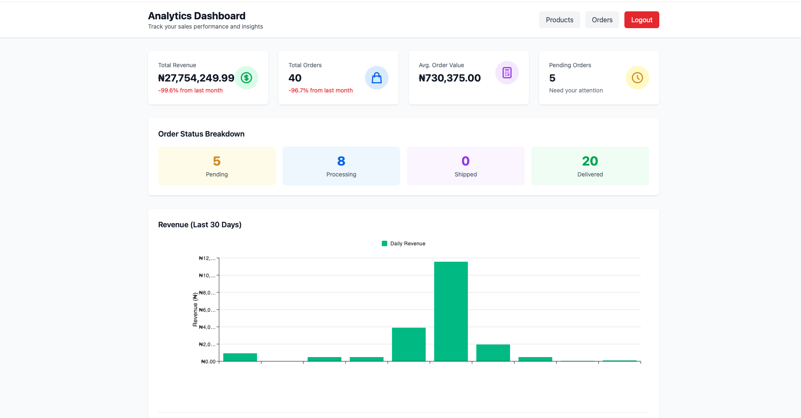

#### Revenue Tracking
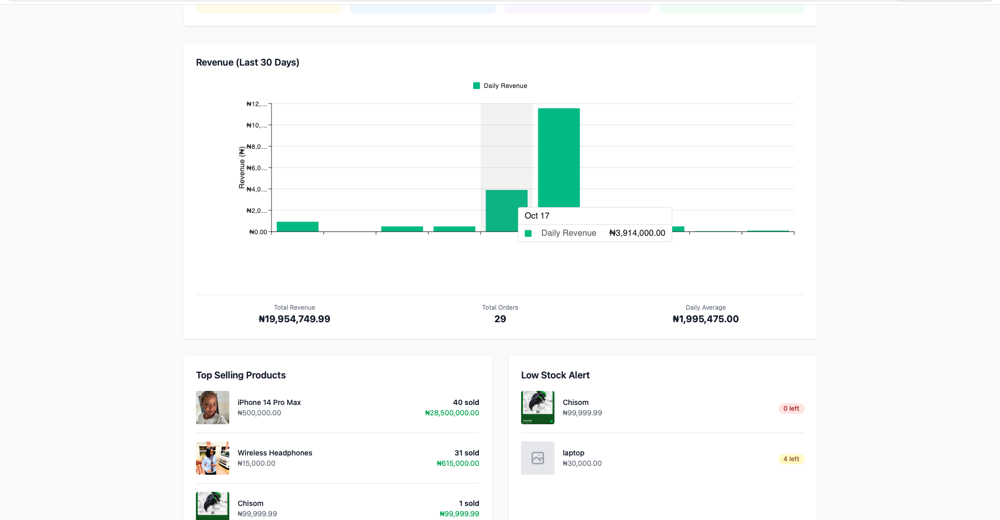

#### Top Products
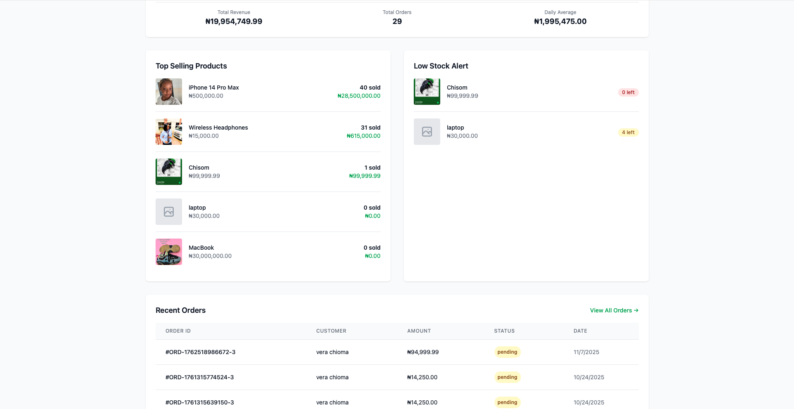

#### Recent Orders
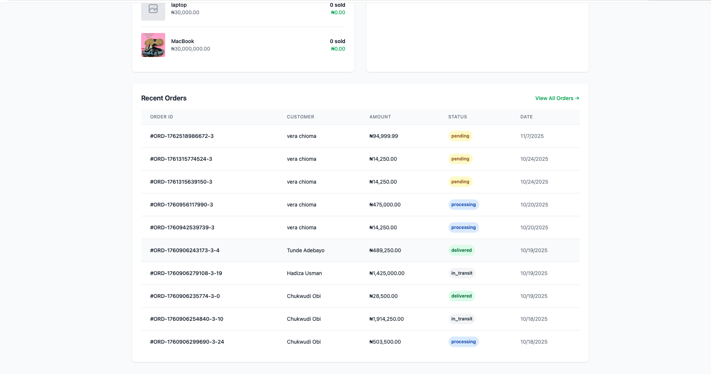

## Getting Started

Refer to [START_HERE.md](START_HERE.md) for setup instructions and [QUICKSTART.md](QUICKSTART.md) for a quick start guide.

## Documentation

- [Build Plan](BUILD_PLAN.md)
- [Testing Guide](TESTING_GUIDE.md)
- [Setup Troubleshooting](SETUP_TROUBLESHOOTING.md)
- [Seller Order Management](SELLER_ORDER_MANAGEMENT_COMPLETE.md)

## Tech Stack

- **Frontend**: Modern JavaScript framework
- **Backend**: Node.js
- **Database**: MongoDB/PostgreSQL

## License

MIT
