# BuyTree

White-label e-commerce infrastructure for sellers in Nigeria. BuyTree gives each seller their own branded storefront — their logo, their colors, their link — powered entirely by BuyTree behind the scenes.

This is not a marketplace. There is no public product feed or central discovery page. Each seller gets an independent store at a custom link (e.g. `buytree.ng/store/shopname`) that they share directly with their own customers. BuyTree is the invisible infrastructure: payments, order management, analytics, and dispute resolution.

Think Shopify, not Amazon.

## What Sellers Get

- A branded storefront (custom logo, background color, shop name)
- A dedicated store link matching their brand name
- Product and inventory management
- Order tracking and fulfillment tools
- Paystack-powered payments with automatic payout (T+1 after delivery)
- Analytics and revenue tracking
- Dispute resolution with buyer protection

## What Buyers Experience

- A seller-branded shopping experience — BuyTree branding is minimal/invisible
- Cart, checkout, and payment via Paystack
- Order tracking: Paid → Ready for Pickup → In Transit → Delivered
- 48-hour dispute window after delivery confirmation
- Minimum order value: ₦4,000

## Platform Rules

- BuyTree takes a 5% fee on every transaction
- Sellers must be approved by a BuyTree admin before going live
- Sellers are paid out T+1 after the buyer confirms delivery

## Screenshots

### Homepage
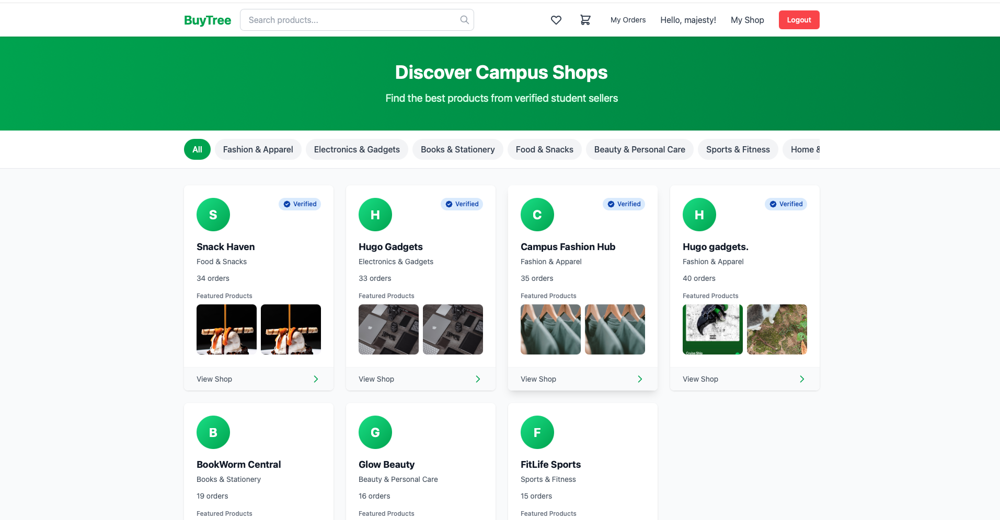

### User Experience

#### Product Details
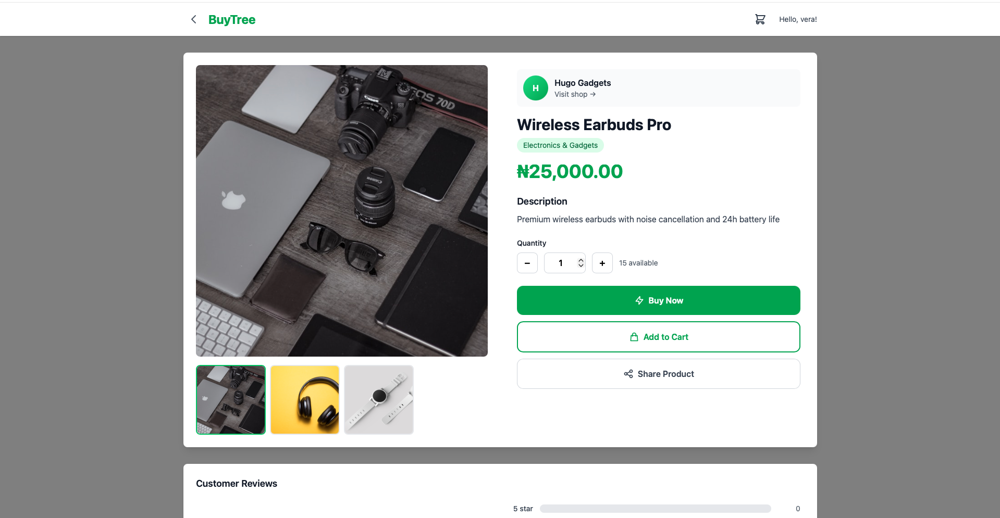

#### Checkout Process
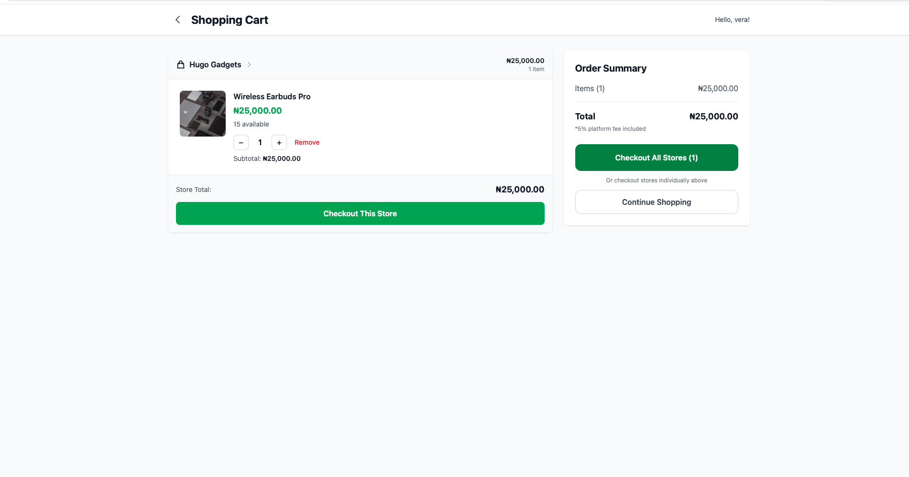
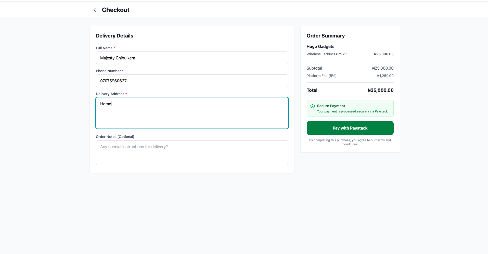
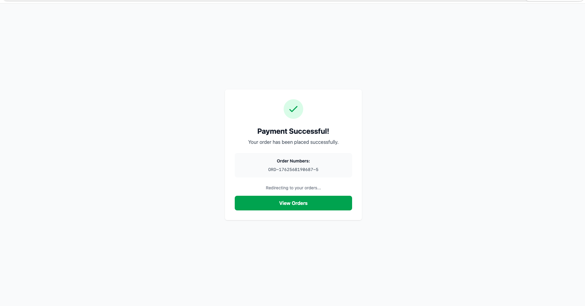

#### Order Tracking
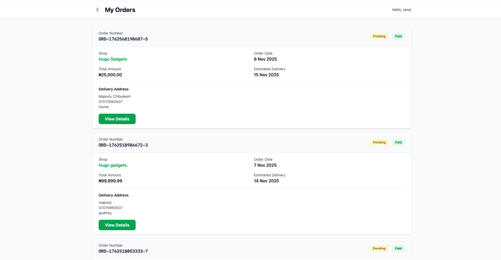

### Seller Dashboard

#### Dashboard Overview
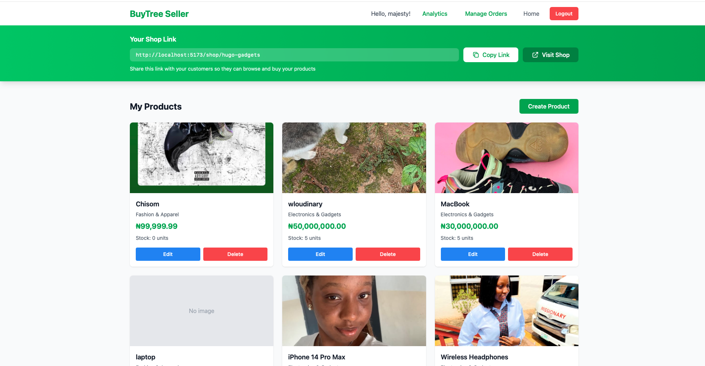

#### Order Management
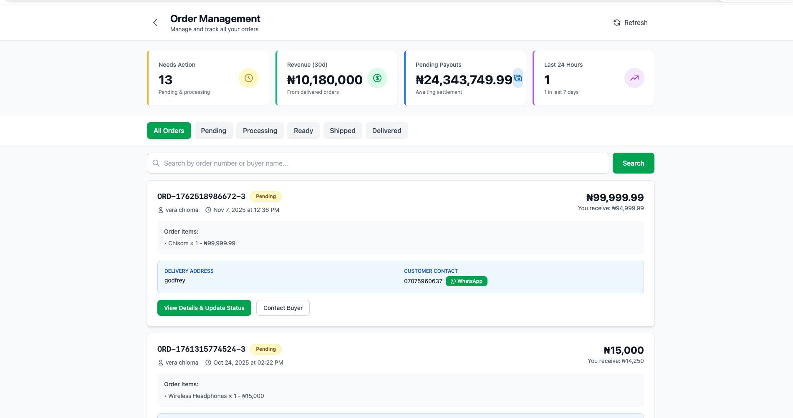

### Analytics

#### Analytics Overview
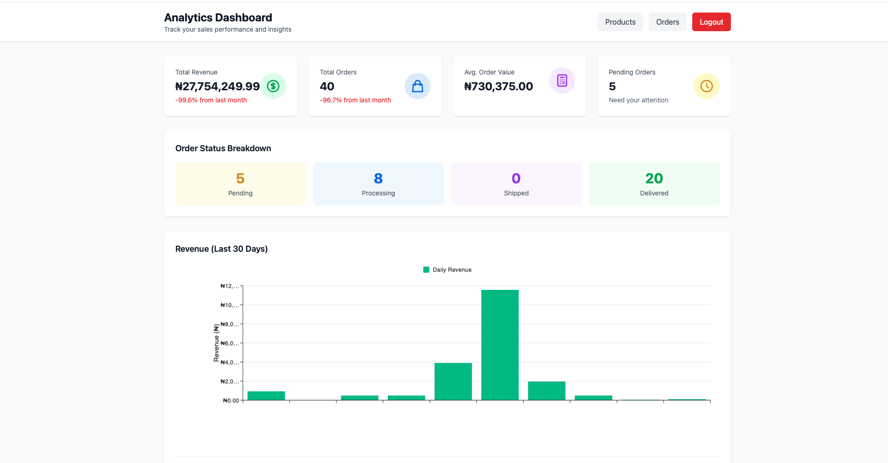

#### Revenue Tracking
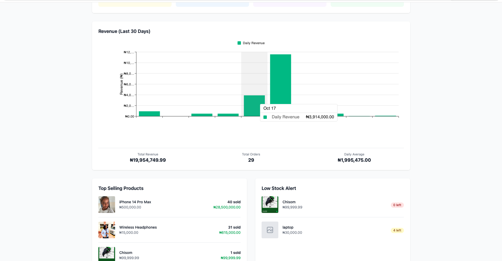

#### Top Products
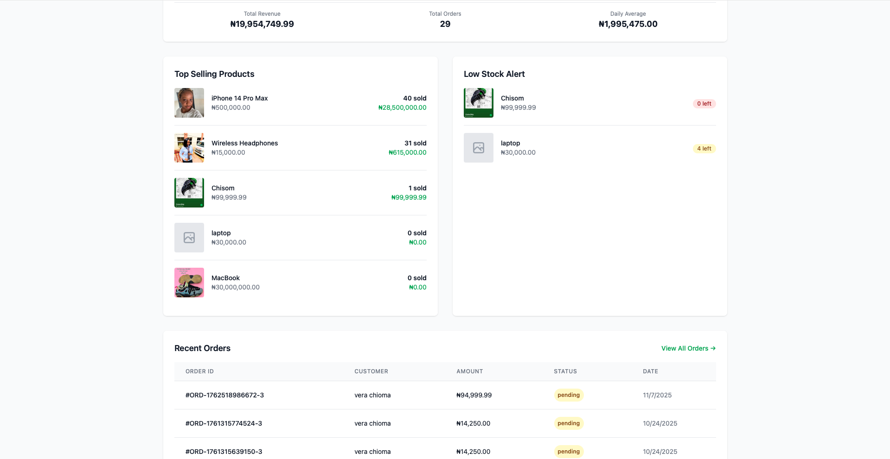

#### Recent Orders
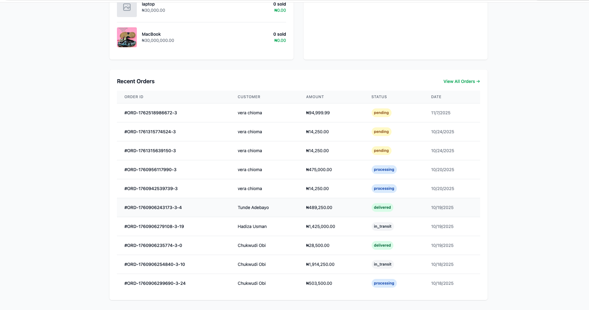

## Getting Started

Refer to [START_HERE.md](START_HERE.md) for setup instructions and [QUICKSTART.md](QUICKSTART.md) for a quick start guide.

## Documentation

- [Build Plan](BUILD_PLAN.md)
- [Testing Guide](TESTING_GUIDE.md)
- [Setup Troubleshooting](SETUP_TROUBLESHOOTING.md)
- [Seller Order Management](SELLER_ORDER_MANAGEMENT_COMPLETE.md)

## Tech Stack

- **Frontend**: React 19 + Vite + Tailwind CSS + Material-UI
- **Backend**: Node.js + Express
- **Database**: PostgreSQL (Supabase)
- **Payments**: Paystack
- **Image Storage**: Cloudinary
- **Email**: Resend

## License

MIT
